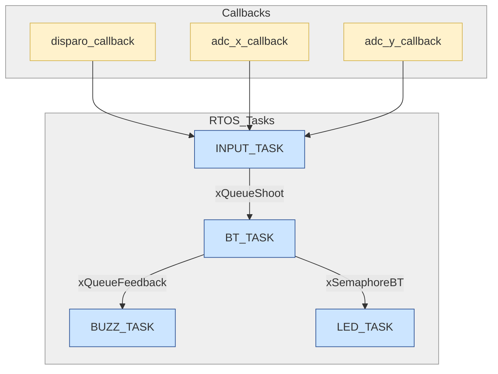

# RP2040 FreeRTOS com OLED1

# Controle Customizado para House of the Dead

## Jogo

**House of the Dead** é um clássico jogo de tiro em trilhos (rail shooter), onde o jogador enfrenta hordas de zumbis em uma narrativa sombria e intensa. Originalmente desenvolvido para arcades, o game é conhecido por seu ritmo acelerado, mira precisa e a adrenalina constante de enfrentar inimigos a cada esquina.

## Ideia do Controle

O controle foi especialmente desenvolvido como uma **arma interativa** para proporcionar uma experiência imersiva em **House of the Dead**. Diferente de um joystick comum, esse controle simula uma pistola com as seguintes características:

- **Movimento da arma controla a câmera**: utilizando sensores analógicos para simular os eixos X e Y.
- **Botão de disparo**: aciona tiros no jogo com resposta imediata.
- **Motor de vibração**: vibra sempre que o jogador dispara e quando morre, aumentando a imersão.
- **Botão de Liga/Desliga**: permite ativar ou desativar o controle.
- **Display OLED**: exibe status do controle, como conexão, munição ou alertas do jogo.

Essa abordagem permite ao jogador se sentir parte da ação, como se estivesse com uma arma real nas mãos, interagindo diretamente com o ambiente do jogo.

## Inputs e Outputs

### Entradas (Inputs)
- **Botão de Liga/Desliga:** Ativa ou desativa o controle.
- **1 Entrada Digital:** Botão de disparo.
- **2 Entradas Analógicas:** Leitura dos sensores de movimento nos eixos X e Y, usados para movimentar a mira no jogo.

> As entradas são tratadas com **callbacks e interrupções** para garantir alta responsividade.

### Saídas (Outputs)
- **Motor de Vibração:** Ativado em cada disparo para proporcionar feedback tátil.
- **Display OLED:** Pode exibir o estado da conexão, munição restante, ou alertas do jogo.
- **LEDs Indicadores:** Sinalizam o status de conexão e funcionamento.

## Protocolo Utilizado

- **Bluetooth:** Comunicação sem fio entre a arma e o emulador do jogo.
- **GPIO Interrupts:** Detecta ações rápidas como o disparo.
- **RTOS (FreeRTOS):** Utilizado para controlar o fluxo das tasks, filas e semáforos, garantindo performance em tempo real para um jogo de tiro.

## Diagrama de Blocos do Firmware

## Principais Componentes do RTOS

- **Tasks:**
  - Leitura dos sensores analógicos (movimento da câmera)
  - Leitura do botão de disparo
  - Comunicação Bluetooth com o emulador
  - Controle de vibração ao atirar
  - Atualização do OLED e LEDs

- **Filas:**
  - Fila de eventos de entrada
  - Fila de comandos para o jogo
  - Fila de feedback de disparo

- **Semáforos:**
  - Gerenciamento do estado da conexão Bluetooth

- **Interrupts:**
  - Callbacks para botão de disparo e sensores de movimento

## Imagens do Controle

### Proposta Inicial

---

---

## Considerações Finais

Este projeto propõe um controle inovador para o jogo **House of the Dead**, transformando o gameplay em uma experiência mais física e realista. Com o uso de sensores analógicos para mira, um motor de vibração para disparos e a integração de FreeRTOS, o sistema entrega performance, responsividade e diversão. Ideal para reviver a sensação dos arcades em casa, de forma criativa e tecnológica.
