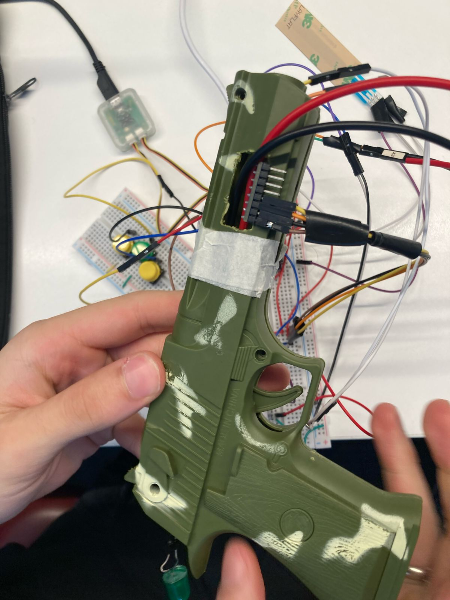

# RP2040 FreeRTOS com OLED1

# Controle Customizado para DOOM

## Jogo

**Doom** é um dos jogos mais icônicos da história dos videogames, lançado originalmente em 1993. Trata-se de um first-person shooter onde o jogador explora mapas labirínticos, derrota hordas de demônios e sobrevive utilizando uma variedade de armas. O jogo é conhecido por sua ação rápida, atmosfera intensa e forte influência na cultura dos jogos eletrônicos.

## Ideia do Controle

O controle foi especialmente desenvolvido como uma **arma interativa** para proporcionar uma experiência imersiva em **Doom**. Diferente de um joystick comum, este projeto desenvolve um controle customizado para jogar DOOM usando a placa Raspberry Pi Pico com FreeRTOS. O controle combina botões físicos e um sensor de movimento MPU6050 para criar uma interface imersiva::

- **Movimentação (WASD)**: Capturada por botões físicos.
- **Mira (mouse):**: Controlada pelo sensor de movimento MPU6050 (acelerômetro e giroscópio).
- **Disparo**: Botão de fogo dedicado.
- **Interação com o ambiente**:  "Sensor de pressão" detecta ação de movimento ou botão separado.
- **Conexão Serial Bluetooth (HC-06)**: Comunicação sem fio com o computador para simular teclado e mouse.

Essa abordagem cria uma sensação dinâmica de controle, combinando movimentos físicos e ações rápidas no teclado/mouse, adaptadas para a jogabilidade de DOOM.

## Inputs e Outputs

### Entradas (Inputs)

- **Botão de Fogo:** Dispara a arma no jogo.
- **Botões direcionais** Movimentação do personagem no mapa.
- **Sensor MPU6050:** Controla o movimento da mira (movimentação do mouse).
- **Sensor de Pressão:** Detecta o movimento para recarregar (via ADC).

> Todos os botões utilizam **interrupções (IRQ)** combinadas com semáforos no FreeRTOS para máxima responsividade.

### Saídas (Outputs)

- **Comunicação Bluetooth (HC-06)**: Transmissão dos comandos para o computador.

## Protocolo Utilizado

- **Bluetooth Serial (HC-06)**: Envia pacotes de 4 bytes (axis + valor + terminador) para o PC.

- **GPIO Interrupts**: Detectam eventos de botão de forma eficiente.

- **I2C (para MPU6050)**: Comunicação com o sensor de movimento.

- **RTOS (FreeRTOS)**: Gerencia tasks, filas e semáforos para multitarefa em tempo real

## Diagrama de Blocos do Firmware

## Principais Componentes do RTOS

- **Tasks:**
  - fire_task: Detecta o disparo e ativa o motor de vibração.

  - movement_task: Trata botões direcionais (WASD).

  - recharge_task: Detecta recarga via sensor.

  - mpu6050_task: Atualiza posição do mouse conforme orientação do controle.

  - uart_task: Envia os pacotes para o computador via Bluetooth.

- **Filas:**
  - Fila de envio de pacotes UART (movimento e disparo).

- **Semáforos:**
  - Gerenciamento de eventos de botão (W, A, S, D e fogo).

- **Interrupts:**
  - Todos os botões usam interrupções para máxima resposta.

## Imagens do Controle

### Proposta Inicial

---

---

### Imagem Final

---

---

## Considerações Finais

Este projeto integra **movimentação realista** e **ação rápida** em um controle físico dedicado para jogar **DOOM**.
Utilizando **FreeRTOS** e o sensor **MPU6050**, o jogador consegue mirar e movimentar seu personagem com fluidez, trazendo uma experiência de gameplay única e imersiva para um dos jogos mais emblemáticos da história.
